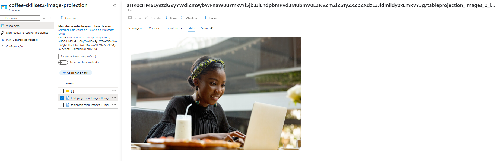

# Explore um índice de Pesquisa AI do Azure (UI)  
Vamos imaginar que você trabalha para a Fourth Coffee, uma cadeia nacional de cafeterias. Você foi solicitado a ajudar a construir uma solução de mineração de conhecimento que facilite a busca por insights sobre as experiências dos clientes. Você decide construir um índice de Pesquisa AI do Azure usando dados extraídos de avaliações de clientes.

Neste laboratório você irá:

* Criar recursos do Azure  
* Extrair dados de uma fonte de dados  
* Enriquecer dados com habilidades de IA  
* Usar o indexador do Azure no portal do Azure  
* Consultar seu índice de pesquisa  
* Revisar resultados salvos em um Armazenamento de Conhecimento  

## Recursos do Azure necessários  
A solução que você criará para a Fourth Coffee requer os seguintes recursos em sua assinatura do Azure:

    * Um recurso de Pesquisa AI do Azure, que gerenciará a indexação e consulta.  
    * Um recurso de serviços de IA do Azure, que fornece serviços de IA para habilidades que sua solução de pesquisa pode usar para enriquecer os dados na fonte de dados com insights gerados por IA.
    * Uma conta de Armazenamento com contêineres de blob, que armazenará documentos brutos e outras coleções de tabelas, objetos ou arquivos.

## Criar um recurso de Pesquisa AI do Azure  
    1 - Faça login no portal do Azure.  

    2 - Clique no botão + Criar um recurso, pesquise por Pesquisa AI do Azure e crie um recurso de Pesquisa AI do Azure com as seguintes configurações:  

        * Assinatura: Sua assinatura do Azure.  
        * Grupo de recursos: Selecione ou crie um grupo de recursos com um nome exclusivo.  
        * Nome do serviço: Um nome exclusivo.  
        * Localização: Escolha qualquer região disponível. Se estiver na costa leste dos EUA, use "East US 2".  
        * Camada de preços: Básica  

    3 - Selecione Revisar + criar e, após ver a resposta Validação bem-sucedida, selecione Criar.  

    4 - Após a conclusão da implantação, selecione Ir para o recurso. Na página de visão geral da Pesquisa AI do Azure, você pode adicionar índices, importar dados e pesquisar índices criados.

## Criar um recurso de serviços de IA do Azure  
Você precisará provisionar um recurso de serviços de IA do Azure que esteja na mesma localização que seu recurso de Pesquisa de IA do Azure. Sua solução de pesquisa usará este recurso para enriquecer os dados no armazenamento com insights gerados por IA.

1 - Volte para a página inicial do portal do Azure. Clique no botão ＋Criar um recurso e pesquise por serviços de IA do Azure. Selecione criar um plano de serviços de IA do Azure. Você será levado a uma página para criar um recurso de serviços de IA do Azure. Configure-o com as seguintes configurações:  

    * Assinatura: Sua assinatura do Azure.  
    * Grupo de recursos: O mesmo grupo de recursos que seu recurso de Pesquisa de IA do Azure.  
    * Região: A mesma localização que seu recurso de Pesquisa de IA do Azure.  
    * Nome: Um nome único.  
    * Camada de preços: Padrão S0  
    * Ao marcar esta caixa, reconheço que li e entendi todos os termos abaixo: Selecionado  

2 - Selecione Revisar + criar. Depois de ver a resposta Validação Aprovada, selecione Criar.

3 - Aguarde a conclusão da implantação e, em seguida, visualize os detalhes da implantação.

## Criar uma conta de armazenamento  
1 - Volte para a página inicial do portal Azure e, em seguida, selecione o botão + Criar um recurso.  

2 - Pesquise por conta de armazenamento e crie um recurso de Conta de Armazenamento com as seguintes configurações:  
    * Assinatura: Sua assinatura do Azure.  
    * Grupo de recursos: O mesmo grupo de recursos que seus recursos de Pesquisa de IA do Azure e serviços de IA do Azure.  
    * Nome da conta de armazenamento: Um nome único.  
    * Localização: Escolha qualquer localização disponível.  
    * Desempenho: Padrão  
    * Redundância: Armazenamento localmente redundante (LRS)  

3 - Clique em Revisar e, em seguida, clique em Criar. Aguarde a conclusão da implantação e, em seguida, vá para o recurso implantado.  

4 - Na conta de armazenamento do Azure que você criou, no painel de menu à esquerda, selecione Configuração (sob Configurações).  

5 - Altere a configuração para Permitir acesso anônimo a Blob para Habilitado e, em seguida, selecione Salvar.

## Carregar Documentos para o Armazenamento do Azure  
1 - No painel de menu à esquerda, selecione Contêineres.

2 - Selecione + Container. Um painel do lado direito se abre.

3 - Insira as seguintes configurações e clique em Criar:

    * Nome: coffee-reviews
    * Nível de acesso público: Container (acesso de leitura anônimo para containers e blobs)
    * Avançado: sem alterações.

4 - Em uma nova aba do navegador, baixe os comentários sobre café compactados de https://aka.ms/mslearn-coffee-reviews e extraia os arquivos para a pasta de comentários.

5 - No portal do Azure, selecione seu container coffee-reviews. No container, selecione Carregar.

## Indexar os documentos  
Depois de ter os documentos armazenados, você pode usar o Azure AI Search para extrair insights dos documentos. O portal do Azure fornece um assistente de Importação de dados. Com este assistente, você pode criar automaticamente um índice e um indexador para fontes de dados suportadas. Você usará o assistente para criar um índice e importar seus documentos de pesquisa do armazenamento para o índice do Azure AI Search.  

1 - No portal do Azure, navegue até o seu recurso do Azure AI Search. Na página de Visão Geral, selecione Importar dados.

2 - Na página Conectar aos seus dados, na lista Fonte de Dados, selecione Armazenamento de Blobs do Azure.
    Preencha os detalhes do armazenamento de dados com os seguintes valores:

    * Fonte de Dados: Armazenamento de Blobs do Azure
    * Nome da fonte de dados: coffee-customer-data
    * Dados a serem extraídos: Conteúdo e metadados
    * Modo de análise: Padrão
    * String de conexão: *Selecione Escolha uma conexão existente. Selecione sua conta de armazenamento, selecione o contêiner coffee-reviews e clique em Selecionar.
    * Autenticação de identidade gerenciada: Nenhuma
    * Nome do contêiner: esta configuração é preenchida automaticamente após você escolher uma conexão existente.
    * Pasta Blob: Deixe em branco.
    * Descrição: Avaliações para as cafeterias Fourth Coffee.

3 - Selecione Próximo: Adicionar habilidades cognitivas (Opcional).

4 - Na seção Anexar Serviços de IA, selecione seu recurso de serviços de IA do Azure.

5 - Na seção Adicionar enriquecimentos:
    * Altere o nome do Skillset para coffee-skillset.
    * Marque a caixa de seleção Habilitar OCR e mescle todo o texto no campo merged_content.
        Observação: É importante selecionar Habilitar OCR para ver todas as opções de campo enriquecido.

    * Certifique-se de que o campo Dados de origem esteja definido como merged_content.
    * Altere o nível de granularidade de enriquecimento para Páginas (blocos de 5000 caracteres).
    * Não selecione Habilitar enriquecimento incremental.
    * Selecione os seguintes campos enriquecidos:

        Campo de parâmetro de habilidade cognitiva Nome
        Extrair nomes de locais Locais
        Extrair frases-chave Frases-chave
        Detectar sentimento Sentimento
        Gerar tags a partir de imagens ImageTags
        Gerar legendas a partir de imagens ImageCaption

6 - Em Salvar enriquecimentos em um repositório de conhecimento, selecione:
    * Projeções de imagem
    * Documentos
    * Páginas
    * Frases-chave
    * Entidades
    * Detalhes da imagem
    * Referências de imagem
        Observação: Um aviso solicitando uma String de Conexão da Conta de Armazenamento é exibido.

7 - Selecione Escolher uma conexão existente. Escolha a conta de armazenamento que você criou anteriormente.
    * Clique em + Contêiner para criar um novo contêiner chamado repositório de conhecimento com o nível de privacidade definido como Privado e selecione Criar.
    * Selecione o contêiner de armazenamento de conhecimento e clique em Selecionar na parte inferior da tela.

8 - Selecione Projeções de blobs do Azure: Documento. Uma configuração para Nome do contêiner com o contêiner de armazenamento de conhecimento preenchido automaticamente é exibida. Não altere o nome do contêiner.

9 - Selecione Avançar: Personalizar índice de destino. Altere o Nome do índice para coffee-index.

10 - Certifique-se de que a Chave esteja definida como metadata_storage_path. Deixe o Nome do Sugeridor em branco e o Modo de pesquisa preenchido automaticamente.

11 - Revise as configurações padrão dos campos de índice. Selecione Filtrante para todos os campos já selecionados por padrão. Os nomes de campo que precisam ser marcados como filtráveis ​​incluem: conteúdo, locais, frases-chave, sentimento, conteúdo mesclado, texto, layoutText, imageTags, imageCaption.

12 - Selecione Avançar: Criar um indexador.

13 - Altere o Nome do indexador para coffee-indexer.

14 - Deixe o Agendamento definido como Uma vez.

15 - Expanda as Opções avançadas. Certifique-se de que a opção Chaves de Codificação Base-64 esteja selecionada, pois as chaves de codificação podem tornar o índice mais eficiente.

16 - Selecione Enviar para criar a fonte de dados, o conjunto de habilidades, o índice e o indexador. O indexador é executado automaticamente e executa o pipeline de indexação, que:
    * Extrai os campos de metadados do documento e o conteúdo da fonte de dados.
    * Executa o conjunto de habilidades cognitivas para gerar campos mais enriquecidos.
    * Mapeia os campos extraídos para o índice.

17 - Retorne à página de recursos do Azure AI Search. No painel esquerdo, em Gerenciamento de Pesquisa, selecione Indexadores. Selecione o coffee-indexer recém-criado. Aguarde um minuto e selecione &orarr; Atualizar até que o Status indique sucesso.

18 - Selecione o nome do indexador para ver mais detalhes.

## Consulta o índice  
Use o Explorador de Pesquisa para escrever e testar consultas. O Explorador de Pesquisa é uma ferramenta integrada ao portal do Azure que oferece uma maneira fácil de validar a qualidade do seu índice de pesquisa. Você pode usar o Explorador de Pesquisa para escrever consultas e revisar resultados em JSON.  

1 - Na página de Visão Geral do seu serviço de Pesquisa, selecione Explorador de Pesquisa na parte superior da tela.

2 - Observe como o índice selecionado é o índice de café que você criou. Abaixo do índice selecionado, mude a visualização para a visualização em JSON.
No campo do editor de consulta JSON, copie e cole:
{
    "search": "*",
    "count": true
}

3 - Selecione Pesquisar. A consulta de pesquisa retorna todos os documentos no índice de pesquisa, incluindo uma contagem de todos os documentos no campo @odata.count. O índice de pesquisa deve retornar um documento JSON contendo seus resultados de pesquisa.

4 - Agora vamos filtrar por localização. No campo do editor de consultas JSON, copie e cole:
{
 "search": "locations:'Chicago'",
 "count": true
}

5 - Selecione Pesquisar. A consulta pesquisa todos os documentos no índice e filtra por avaliações com uma localização em Chicago. Você deve ver 3 no campo @odata.count.

6 - Agora vamos filtrar por sentimento. No campo do editor de consultas JSON, copie e cole:
{
 "search": "sentiment:'negative'",
 "count": true
}

7 - Selecione Pesquisar. A consulta pesquisa todos os documentos no índice e filtra as avaliações com um sentimento negativo. Você deve ver 1 no campo @odata.count.

    Observação: Veja como os resultados são classificados pelo @search.score. Este é o escore atribuído pelo mecanismo de busca para mostrar quão de perto os resultados correspondem à consulta dada.

8 - Um dos problemas que podemos querer resolver é por que pode haver certas avaliações. Vamos dar uma olhada nas frases-chave associadas à avaliação negativa. O que você acha que pode ser a causa da avaliação?

## Revisar o repositório de conhecimento  
Vamos ver o poder do repositório de conhecimento em ação. Quando você executou o assistente de Importação de dados, você também criou um repositório de conhecimento. Dentro do repositório de conhecimento, você encontrará os dados enriquecidos extraídos pelas habilidades de IA que persistem na forma de projeções e tabelas.  

1 - No portal do Azure, navegue de volta para sua conta de armazenamento do Azure.  

2 - No painel de menu à esquerda, selecione Contêineres. Selecione o contêiner do repositório de conhecimento.

3 - Você verá uma lista de pastas. Há uma pasta para todos os metadados de cada documento de revisão. Selecione qualquer uma das pastas. Dentro da pasta, clique no arquivo objectprojection.json.

4 - Selecione Editar para ver o JSON produzido para um dos documentos do seu armazenamento de dados Azure.

5 - Selecione o breadcrumb do blob de armazenamento no canto superior esquerdo da tela para retornar aos Contêineres da conta de Armazenamento.

6 - Nos Contêineres, selecione o contêiner coffee-skillset-image-projection. Selecione qualquer um dos itens.

7 - Selecione qualquer um dos arquivos .jpg. Selecione Editar para ver a imagem armazenada do documento. Note como todas as imagens dos documentos são armazenadas dessa maneira.

8 - Selecione o breadcrumb de armazenamento de blob no canto superior esquerdo da tela para retornar aos Contêineres da conta de Armazenamento.

9 - Selecione o navegador de Armazenamento no painel à esquerda e selecione Tabelas. Há uma tabela para cada entidade no índice. Selecione a tabela coffeeSkillsetKeyPhrases.

Observe as frases-chave que o repositório de conhecimento conseguiu capturar do conteúdo nas avaliações. Muitos dos campos são chaves, então você pode vincular as tabelas como em um banco de dados relacional. O último campo mostra as frases-chave que foram extraídas pelo conjunto de habilidades.

