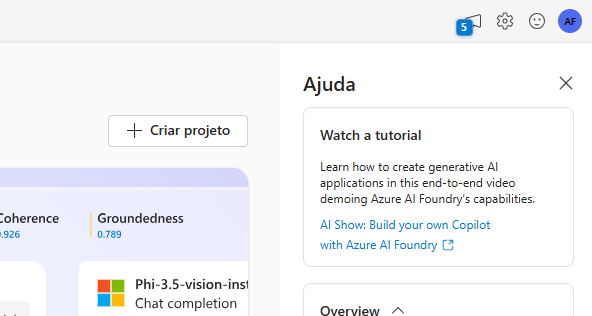

### Explorar a fala no portal do Azure AI Foundry
O serviço de fala do Azure AI transcreve fala em texto e texto em fala audível. Você pode usar o AI Speech para criar um aplicativo que possa transcrever notas de reuniões ou gerar texto a partir da gravação de entrevistas.

Neste exercício, você usará o Azure AI Speech no portal Azure AI Foundry, a plataforma da Microsoft para criar aplicativos inteligentes, para transcrever áudio usando as experiências integradas de teste.

## Criar um projeto no portal Azure AI Foundry

1 - Em uma aba do navegador, navegue até o Azure AI Foundry.

2 - Faça login com sua conta.

3 - Na página inicial do portal Azure AI Foundry, selecione Criar um projeto. No Azure AI Foundry, projetos são contêineres que ajudam a organizar seu trabalho.

4 - No painel Criar um projeto, você verá um nome de projeto gerado, que pode manter como está. Dependendo de você ter criado um hub no passado, você verá uma lista de novos recursos do Azure a serem criados ou uma lista suspensa de hubs existentes. Se você ver a lista suspensa de hubs existentes, selecione Criar novo hub, crie um nome exclusivo para o seu hub e selecione Avançar.

5- Após a criação dos recursos, você será levado à página de Visão Geral do seu projeto. No menu à esquerda da tela, selecione Serviços de IA.

6 - Na página de Serviços de IA, selecione o bloco de Fala para experimentar as capacidades de Fala da IA do Azure.

## Vamos experimentar a conversão de fala em texto no Playground de Fala do Azure AI Foundry.  

1 - Na página de Fala, role para baixo e selecione Transcrição em tempo real em Experimente as capacidades de Fala. Você será levado ao Playground de Fala.  

2 - Selecione https://aka.ms/mslearn-speech-files para baixar speech.zip. Abra a pasta.  

3 - Em Enviar arquivos, selecione Procurar arquivos e navegue até a pasta onde você salvou o arquivo. Selecione o arquivo desejado e depois Abra.

4 - O serviço de Fala transcreve e exibe o texto em tempo real. Se você tiver áudio em seu computador, pode ouvir a gravação enquanto o texto está sendo transcrito.

5 - Revise a saída, que deve ter reconhecido e transcrito com sucesso o áudio em texto.

Neste exercício, você experimentou os serviços de Fala da Azure AI no Speech Playground da Azure AI Foundry. Você então usou a transcrição em tempo real para transcrever uma gravação de áudio. Você pôde ver a transcrição do texto sendo gerada enquanto o arquivo de áudio era reproduzido.

## Limpeza
Se você não pretende fazer mais exercícios, exclua quaisquer recursos que não precise mais. Isso evita acumular custos desnecessários.

1 - Abra o portal do Azure e selecione o grupo de recursos que contém o recurso que você criou. 
2 - Selecione o recurso e clique em Excluir e, em seguida, em Sim para confirmar. O recurso será então excluído.