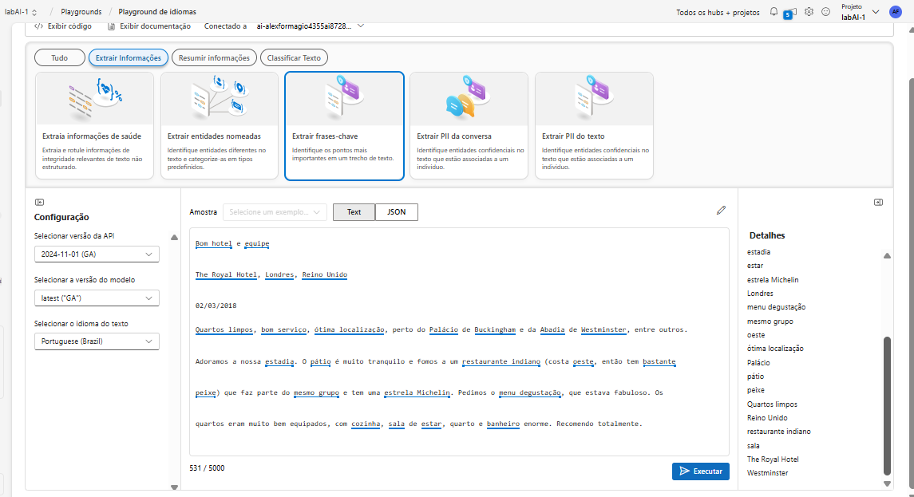

# Analisar texto no portal Azure AI Foundry

O Processamento de Linguagem Natural (PLN) é um ramo da IA que lida com linguagem escrita e falada. Você pode usar o PLN para construir soluções que extraem significado semântico de texto ou fala, ou que formulam respostas significativas em linguagem natural.

O serviço de Linguagem do Azure AI inclui Análise de Texto, com capacidades como reconhecimento de entidades, extração de frases-chave, sumarização e análise de sentimentos. Por exemplo, suponha que a fictícia agência de viagens Margie's Travel incentive os clientes a enviar avaliações sobre estadias em hotéis. Você poderia usar o serviço de Linguagem para extrair entidades nomeadas, identificar frases-chave, resumir texto e mais.

Neste exercício, você usará o Azure AI Language no portal Azure AI Foundry, a plataforma da Microsoft para criar aplicações inteligentes, para analisar avaliações de hotéis.

## Criar um projeto no portal Azure AI Foundry
1 - Em uma aba do navegador, navegue até o Azure AI Foundry.
2 - Faça login com sua conta.
3 - Na página inicial do portal Azure AI Foundry, selecione Criar um projeto. 

No Azure AI Foundry, projetos são contêineres que ajudam a organizar seu trabalho.

4 - No painel Criar um projeto, você verá um nome de projeto gerado, que pode manter como está. Dependendo de você ter criado um hub no passado, você verá uma lista de novos recursos do Azure a serem criados ou uma lista suspensa de hubs existentes. Se você ver a lista suspensa de hubs existentes, selecione Criar novo hub, crie um nome exclusivo para o seu hub e selecione Avançar.

5 - Após os recursos serem criados, você será levado à página de Visão Geral do seu projeto. No menu à esquerda da tela, selecione Playground.

6- Na página Playgrounds, selecione o bloco de playground de Linguagem para experimentar algumas capacidades de Linguagem da Azure AI.

## Extraia entidades nomeadas com o Azure AI Language no portal Azure AI Foundry
Entidades nomeadas são palavras que descrevem pessoas, lugares e objetos com nomes próprios. Vamos usar a capacidade de extração de entidades nomeadas do Azure AI Language para identificar tipos de informações em uma avaliação.

1 - No playground de Linguagem, selecione Extrair informações. Em seguida, selecione o bloco Extrair entidades nomeadas.

2 - Na seção Amostra, copie e cole a seguinte avaliação:

3 - Selecione Executar. Revise a saída. Observe na seção Detalhes como as entidades extraídas vêm com informações adicionais, como tipo e pontuações de confiança. A pontuação de confiança representa a probabilidade de que o tipo identificado realmente pertença a essa categoria.

## Extraia frases-chave com o Azure AI Language no portal Azure AI Foundry
Frases-chave são as informações mais importantes em um texto. Vamos usar a capacidade de extração de frases-chave do Azure AI Language para extrair informações importantes de uma avaliação.

1 - No playground de Linguagem, selecione Extrair informações. Em seguida, selecione o bloco Extrair frases-chave.

2 - Na seção Amostra, copie e cole a seguinte amostra.

3 - Selecione Executar. Revise a saída. Observe as diferentes frases extraídas na seção Detalhes. Essas frases devem contribuir mais para o significado do texto.

## Resuma o texto com o Azure AI Language no portal Azure AI Foundry. 
1 - Vamos analisar as capacidades de resumo do Azure AI Language. No playground de Linguagem, selecione Resumir informações, em seguida, selecione o bloco Resumir texto. 

2 - Na amostra, copie e cole a seguinte avaliação:
3 - Selecione Executar. Revise a saída. Observe que o resumo extrativo em Detalhes fornece pontuações de classificação para as frases mais salientes.

### Resultado do Resumo:
Detalhes
### Resumo de extração:
(Pontuação de classificação: 78%) Very noisy and rooms are tiny
(Pontuação de classificação: 100%) The Lombard Hotel, San Francisco, USA
(Pontuação de classificação: 76%) Hotel is located on Lombard street which is a very busy SIX lane street directly off the Golden Gate Bridge.

### Resumo de abstração:

The reviewer experienced significant noise pollution and small room sizes during their stay at The Lombard Hotel in San Francisco, noting the busy Lombard Street location and persistent traffic, particularly on weekends. Despite the hotel'dedouble efforts to update rooms, the insulation was inadequate, necessitating the use of cotton balls in the ears to sleep. The chosen room, intended for two queen-sized beds, was disappointingly cramped, making it unsuitable for a family of four. However, the hotel was commended for maintaining cleanliness and its convenient location in the Marina District, which offers various dining options within walking distance. The overall tone suggests a mixed experience, with negative aspects primarily related to noise and space, but some positive attributes in terms of cleanliness and locale. The review could be particularly unappealing for guests seeking quiet and spacious accommodations.

## Limpar
Se você não pretende fazer mais exercícios, exclua quaisquer recursos que não precisa mais. Isso evita acumular custos desnecessários.

1 - Abra o portal do Azure em https://portal.azure.com e selecione o grupo de recursos que contém os recursos que você criou.

2 - Selecione os recursos e clique em Excluir e depois em Sim para confirmar. Os recursos serão excluídos.