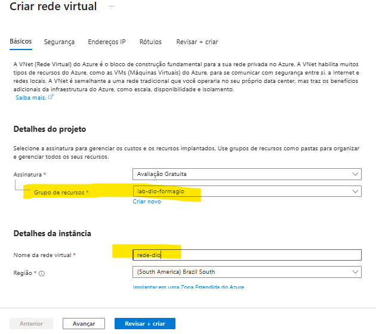
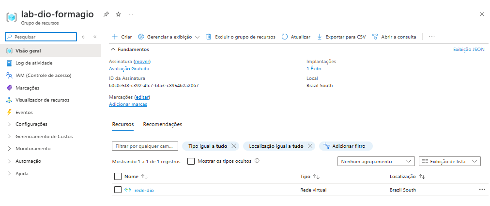

### Construindo arquitetura no Azure

## Grupo de recursos

Neste arquivo estou documentando aquilo que foi mostrado na video aula.
Inicialmente fazemos a criação de um grupo de recursos e adicionamos a ele uma rede virtual e uma máquina virtual debian 12 sendo criada e adicionada ao grupo de recursos.

## 1 - Imagens referentes a criação do grupo de recursos:

## 2 - Imagens referente a criação de uma rede virtual dentro do grupo:

## 3 - Imagem referente a maquina virtual criada e adicionada ao grupo:

## 4 - Imagem referente a maquina virtual sendo acessada:

## 4 - Imagem referente a logs de atividade do grupo
