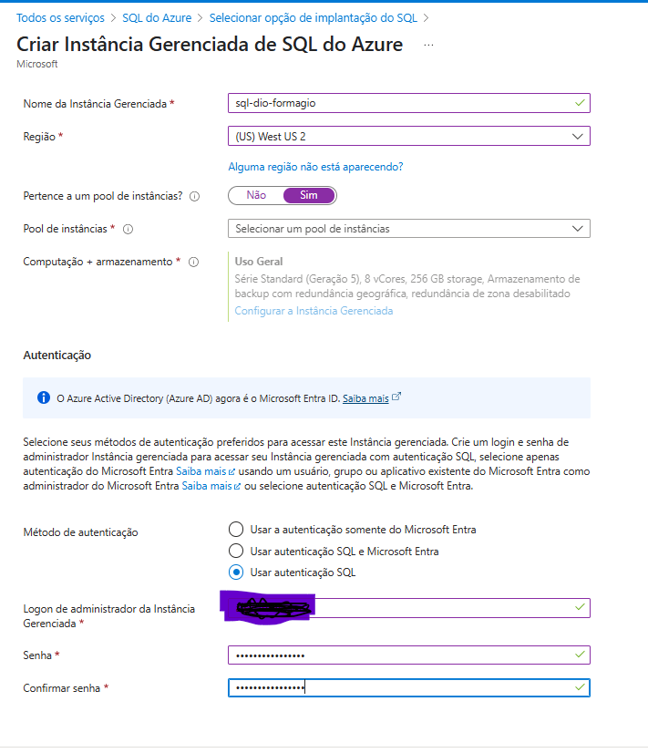
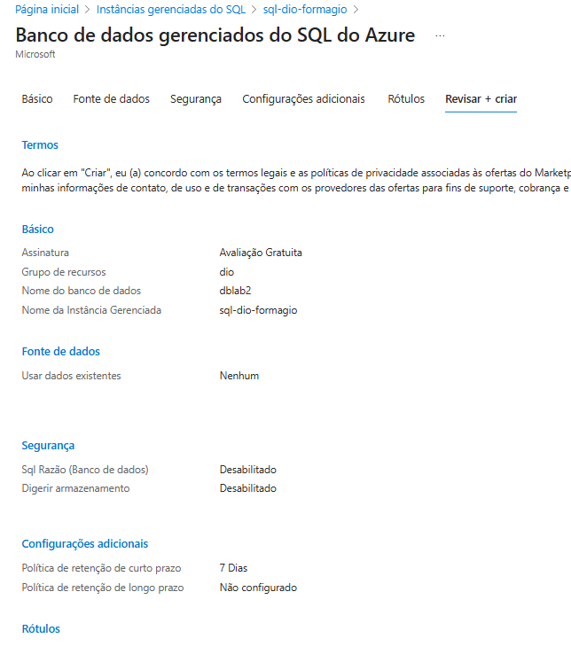
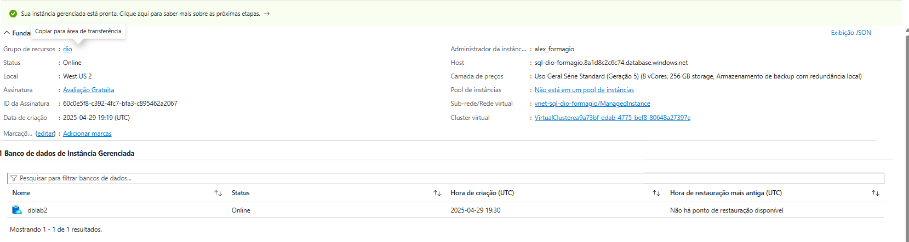
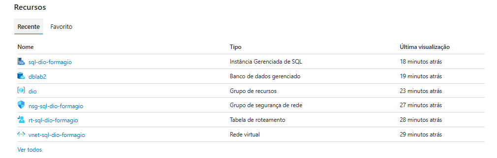

### criar Instância Gerenciada de SQL do Azure

Seguindo o tutorial proposto em aula:
https://learn.microsoft.com/pt-br/azure/azure-sql/managed-instance/instance-create-quickstart?view=azuresql&tabs=azure-portal

## 1 - Imagem referente a criação da Instância Gerenciada no Azure:

## 2 - Imagem referente a criação do Banco de dados

## 3 - Imagem referente a informações do DB

## 4 - Recursos Criados
