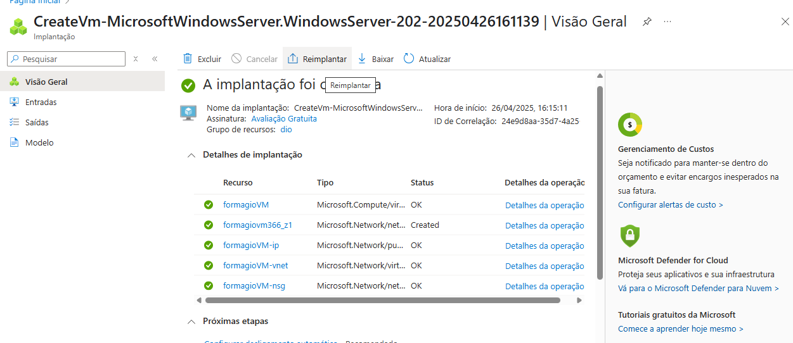
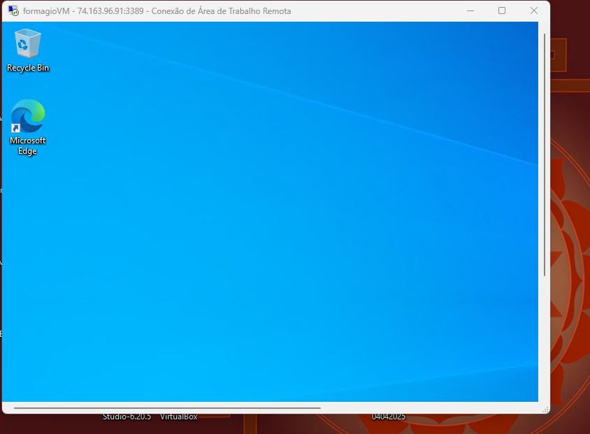
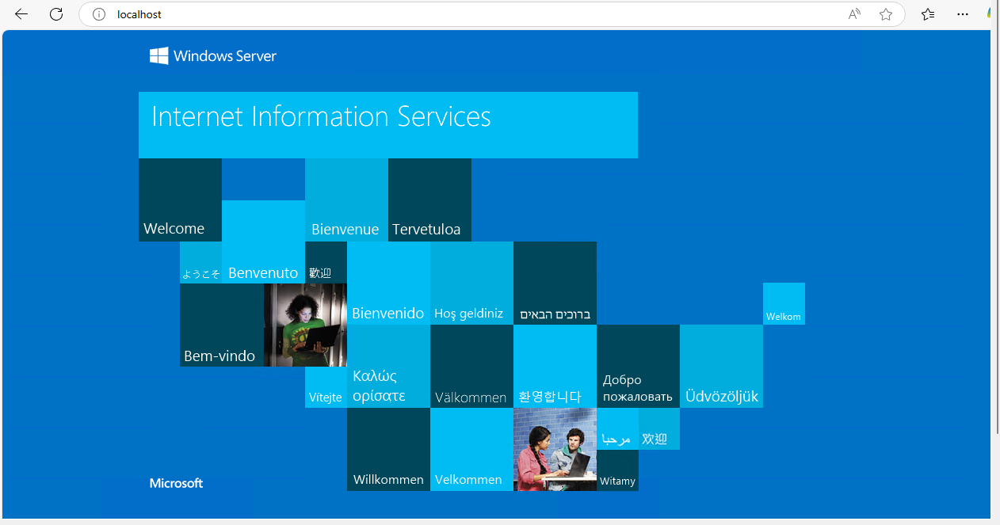

### Criando maquina virtual 

Seguindo o tutorial proposto em aula:
https://learn.microsoft.com/pt-br/azure/virtual-machines/windows/quick-create-portal#create-virtual-machine

## 1 - Imagem referente a criação da maquina virtual:

## 1 - Imagem referente a inicialização da VM:

## 1 - Imagem referente a execução do IIS:
