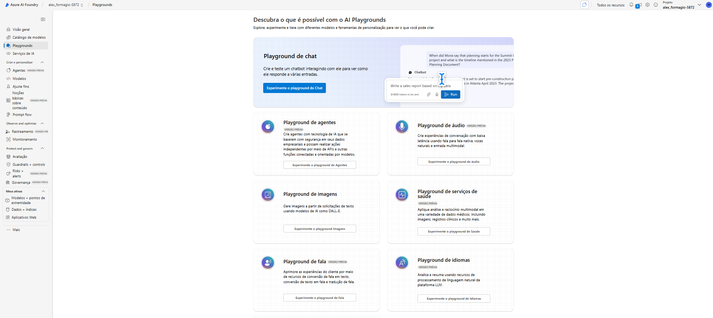
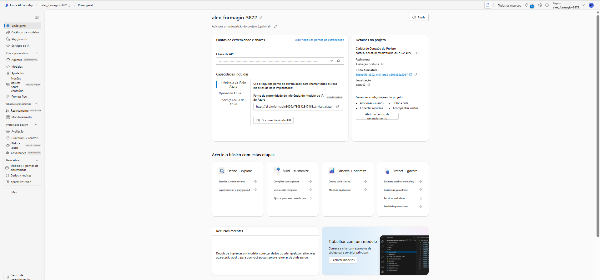
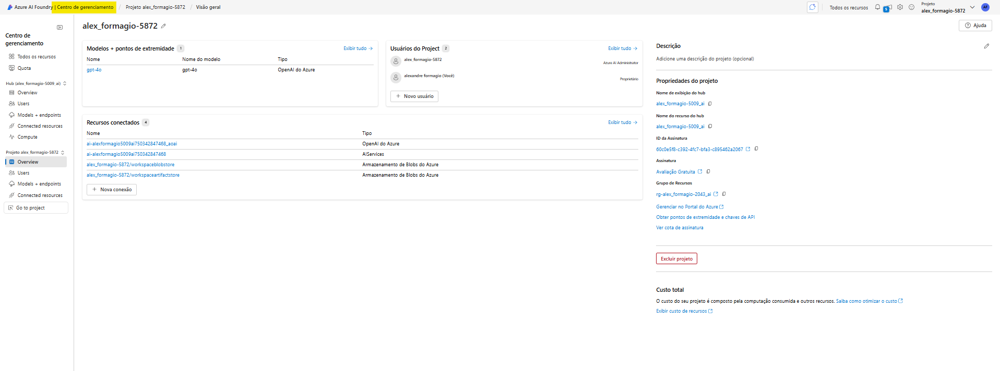
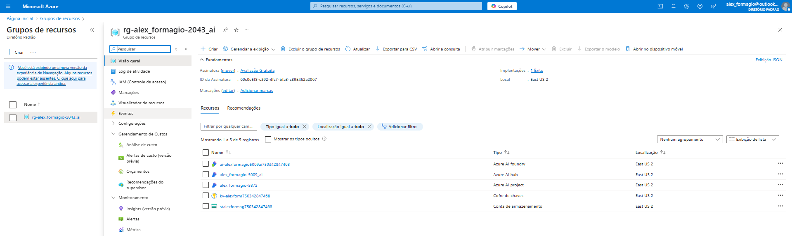
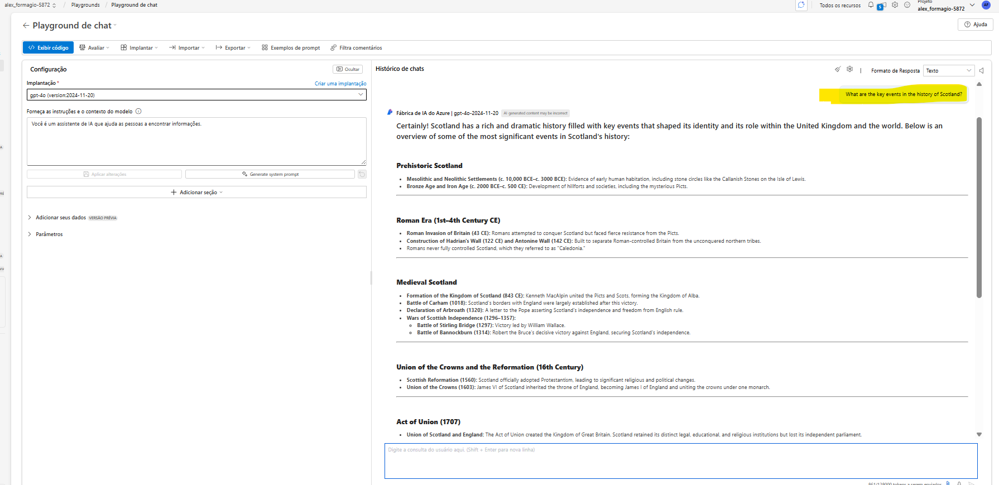

# Prepare-se para um projeto de desenvolvimento de IA  

Neste exercício, você usa o portal Azure AI Foundry para criar um hub e um projeto, prontos para uma equipe de desenvolvedores construir uma solução de IA.

## Abra o portal do Azure AI Foundry  
Vamos começar fazendo login no portal do Azure AI Foundry.  

Em um navegador da web, abra o portal do Azure AI Foundry em https://ai.azure.com e faça login usando suas credenciais do Azure. Feche quaisquer dicas ou painéis de início rápido que estejam abertos na primeira vez que você fizer login e, se necessário, use o logotipo do Azure AI Foundry no canto superior esquerdo para navegar até a página inicial, que se parece com a imagem a seguir (feche o painel de Ajuda se estiver aberto):

### Criar um projeto  
Um projeto de IA do Azure fornece um espaço de trabalho colaborativo para o desenvolvimento de IA. Vamos começar escolhendo um modelo com o qual queremos trabalhar e criando um projeto para usá-lo.  

1 - Na página inicial, na seção Explorar modelos e capacidades, procure pelo modelo gpt-4o; que usaremos em nosso projeto.  
2 - Nos resultados da pesquisa, selecione o modelo gpt-4o para ver seus detalhes e, em seguida, na parte superior da página do modelo, selecione Usar este modelo.  
3 - Quando solicitado a criar um projeto, insira um nome válido para seu projeto e expanda Opções avançadas.  
4 - Selecione Personalizar e especifique as seguintes configurações para seu hub:  
    * Recurso do Azure AI Foundry: Um nome válido para seu recurso do Azure AI Foundry  
    * Assinatura: Sua assinatura do Azure  
    * Grupo de recursos: Crie ou selecione um grupo de recursos  
    * Região: Selecione qualquer local suportado pelos Serviços de IA*

5 - Selecione Criar e aguarde a criação do seu projeto, incluindo a implantação do modelo gpt-4 que você selecionou. 
6 - Quando seu projeto for criado, o playground de chat será aberto automaticamente para que você possa testar seu modelo:

7 - No painel de navegação à esquerda, selecione Visão Geral para ver a página principal do seu projeto; que se parece com isto:

8 - Na parte inferior do painel de navegação à esquerda, selecione Centro de gerenciamento. O centro de gerenciamento é onde você pode configurar as configurações tanto no nível de recurso quanto no nível de projeto; que estão ambos mostrados no painel de navegação.

O nível de recurso refere-se ao recurso do Azure AI Foundry que foi criado para apoiar seu projeto. Este recurso inclui conexões com os Serviços de IA do Azure e modelos do Azure AI Foundry; e fornece um local central para gerenciar o acesso dos usuários a projetos de desenvolvimento de IA.

O nível do projeto refere-se ao seu projeto individual, onde você pode adicionar e gerenciar recursos específicos do projeto.

9 - No painel de navegação, na seção do seu recurso do Azure AI Foundry, selecione a página Visão Geral para ver seus detalhes. 

10 - Selecione o link para o grupo de recursos associado ao recurso para abrir uma nova aba do navegador e navegar até o portal do Azure.   Faça login com suas credenciais do Azure, se solicitado. 

11 - Visualize o grupo de recursos no portal do Azure para ver os recursos do Azure que foram criados para apoiar seu recurso do Azure AI Foundry e seu projeto.

Observe que os recursos foram criados na região que você selecionou ao criar o projeto.

12 - Feche a aba do portal Azure e retorne ao portal Azure AI Foundry.

## Reveja as conexões do projeto
Seu projeto Azure AI Foundry e o recurso Azure AI Foundry ao qual pertence incluem conexões com recursos que você pode usar em aplicações de IA.

1 - Na página do centro de gerenciamento, no painel de navegação, sob seu projeto, selecione Ir para o projeto.
2 - Na página de Visão Geral do projeto, visualize a seção Endpoints e chaves; que contém endpoints e chaves de autorização que você pode usar em seu código de aplicação para acessar:
    * O projeto Azure AI Foundry e quaisquer modelos implantados nele.
    * Azure OpenAI em modelos do Azure AI Foundry.
    * Serviços de IA do Azure.

## Teste um modelo de IA generativa  
Agora que você sabe algo sobre a configuração do seu projeto Azure AI Foundry, pode voltar ao playground de chat para explorar o modelo que você implantou.  

1 - No painel de navegação à esquerda do seu projeto, selecione Playgrounds  

2- Abra o playground de Chat e certifique-se de que a implantação do seu modelo gpt-4o está selecionada na seção de Implantação.  

3 - No painel de Configuração, na caixa Dê instruções e contexto ao modelo, insira as seguintes instruções:    

 You are a history teacher who can answer questions about past events all around the world.

 4 - Aplique as alterações para atualizar a mensagem do sistema. 
 
 5 - Na janela de chat, insira uma consulta como Quais são os principais eventos na história da Escócia? e veja a resposta:

## Resumo  
Neste exercício, você explorou o Azure AI Foundry e viu como criar e gerenciar projetos e seus recursos relacionados.

