# Explore a IA generativa no Portal Azure AI Foundry  

A IA generativa descreve uma categoria de capacidades dentro da IA que criam conteúdo. As pessoas normalmente interagem com a IA generativa que foi incorporada em aplicativos de chat. Neste exercício, você experimenta a IA generativa no portal Azure AI Foundry, a plataforma da Microsoft para criar aplicativos inteligentes.  

## Crie um projeto no portal Azure AI Foundry

1 - Em uma aba do navegador, navegue até o Azure AI Foundry.

2 - Faça login com sua conta.

3 - Na página inicial do portal Azure AI Foundry, selecione Criar um projeto. No Azure AI Foundry, projetos são contêineres que ajudam a organizar seu trabalho.

4 - No painel Criar um projeto, você verá um nome de projeto gerado, que pode manter como está. Dependendo de você ter criado um hub no passado, você verá uma lista de novos recursos do Azure a serem criados ou uma lista suspensa de hubs existentes. Se você ver a lista suspensa de hubs existentes, selecione Criar novo hub, crie um nome exclusivo para o seu hub e selecione Avançar.

## Explore a IA generativa no playground de chat do Azure AI Foundry

1 - Na página de Playgrounds do Azure AI Foundry, selecione Experimente o playground de chat. O playground de chat é uma interface de usuário que permite experimentar a construção de um aplicativo de chat com diferentes modelos de IA generativa.

2 - Para usar o playground de chat, você precisa associá-lo a um modelo implantado. No playground de chat, selecione Criar uma implantação. Pesquise e selecione gpt-4.

3 - Na janela Implantar modelo, mantenha a nomenclatura e seleção padrão e selecione Implantar. Pode levar um momento para o modelo ser implantado. Você pode verificar o status da sua implantação selecionando Modelos e endpoints no menu à esquerda em Meus ativos.

4 - No playground de chat, você pode usar seu modelo implantado quando ele aparecer no menu de seleção de Implantação. Certifique-se de que o modelo que você implantou está selecionado. É importante que você selecione Aplicar alterações após fazer qualquer modificação na Configuração.

5 - Considere as seguintes maneiras de melhorar as respostas de um assistente de IA generativa:

    * Comece com um objetivo específico para o que você deseja que o assistente faça

    * Itere com base em prompts e respostas anteriores para refinar o resultado

    * Forneça uma fonte para fundamentar a resposta em um escopo específico de informação

    * Adicione contexto para maximizar a adequação e relevância da resposta

    * Defina expectativas claras para a resposta

6 - Vamos tentar gerar uma resposta usando um prompt com um objetivo específico. Na caixa de chat, insira o seguinte...
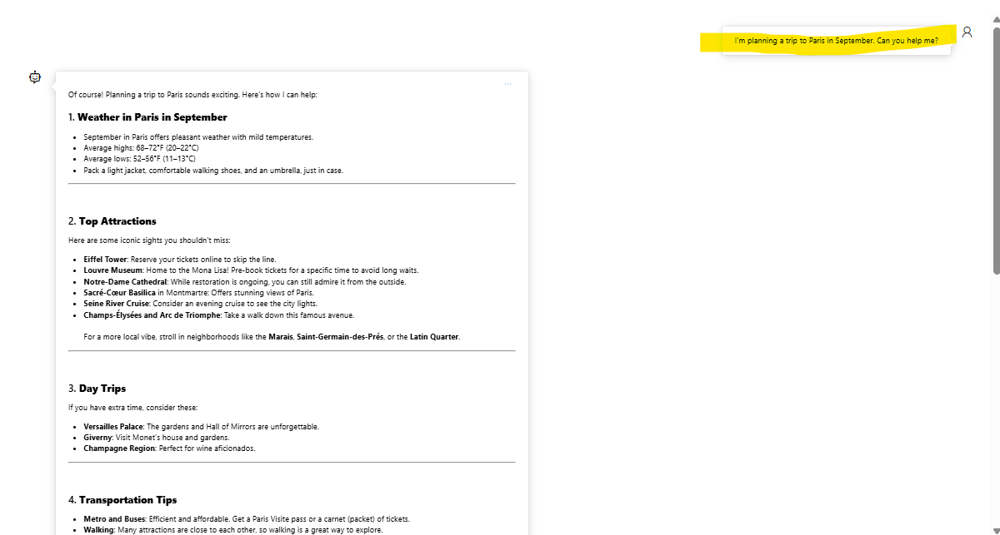
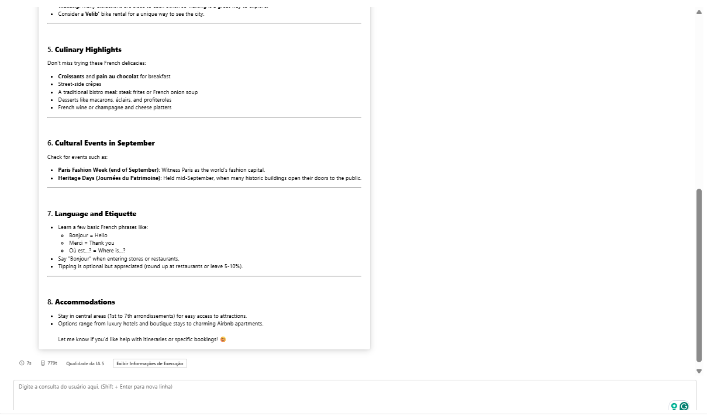

7 - Revise a resposta. Nota: Tenha em mente que a resposta específica que você recebe pode variar devido à natureza da IA generativa.

8 - Vamos tentar outro prompt. Digite o seguinte:
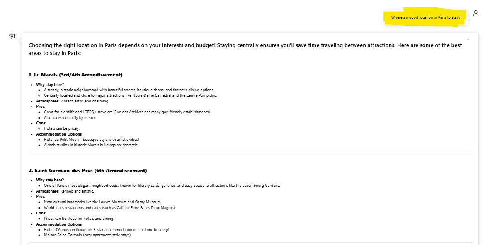
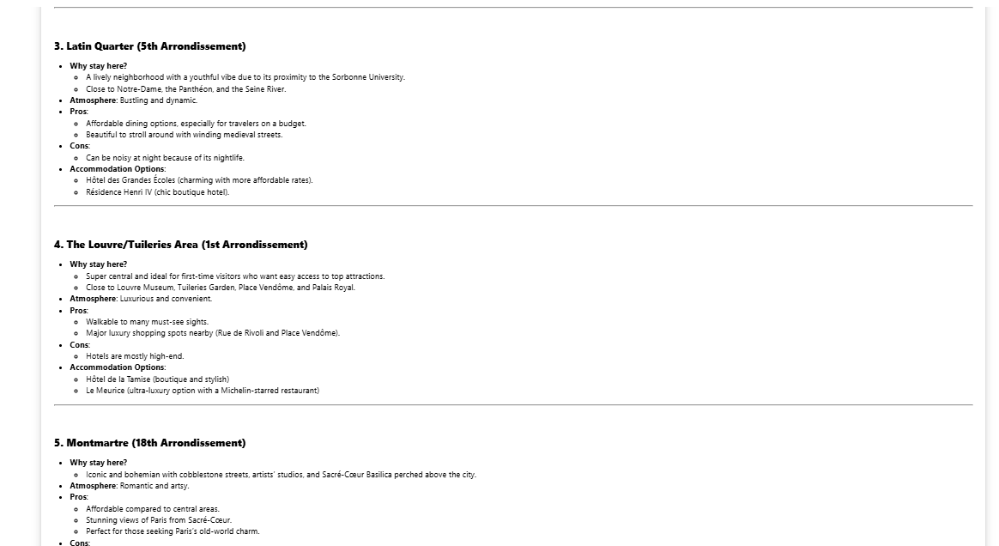

9 - Revise a resposta, que deve fornecer alguns lugares para ficar em Paris.

10 - Vamos iterar com base em prompts e respostas anteriores para refinar o resultado. Insira o seguinte prompt:
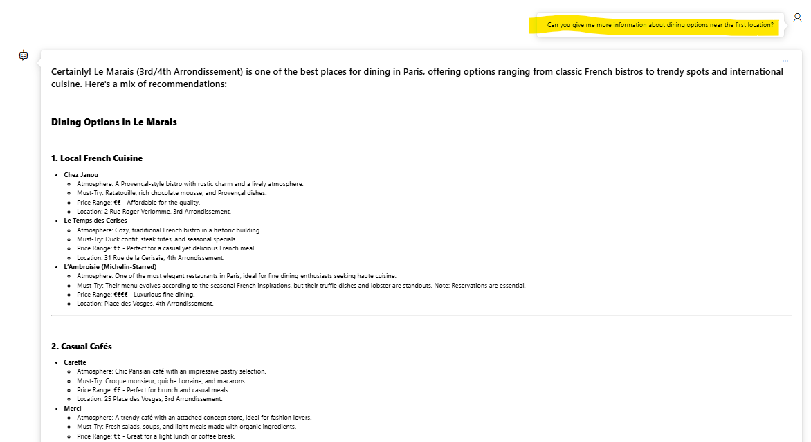
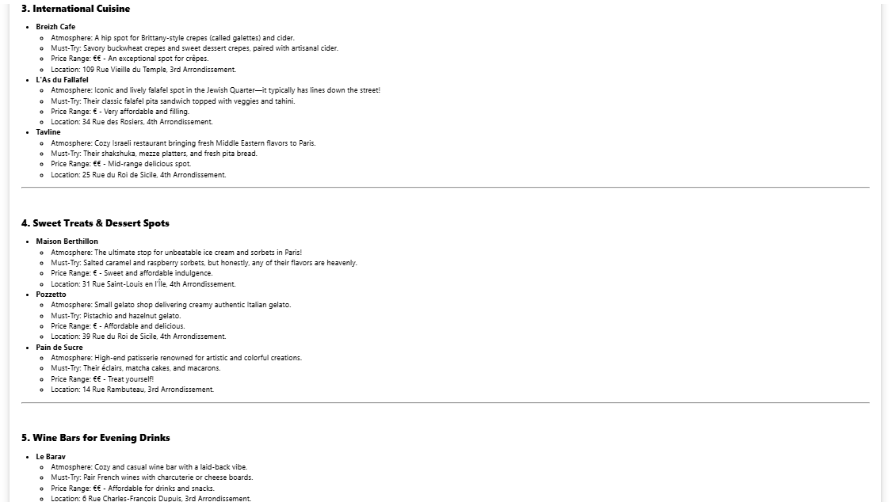

11 - Revise a resposta, que deve fornecer opções de refeições perto de uma localização da resposta anterior.

12 - Agora, vamos fornecer uma fonte para fundamentar a resposta em um escopo específico de informações. Insira o seguinte:
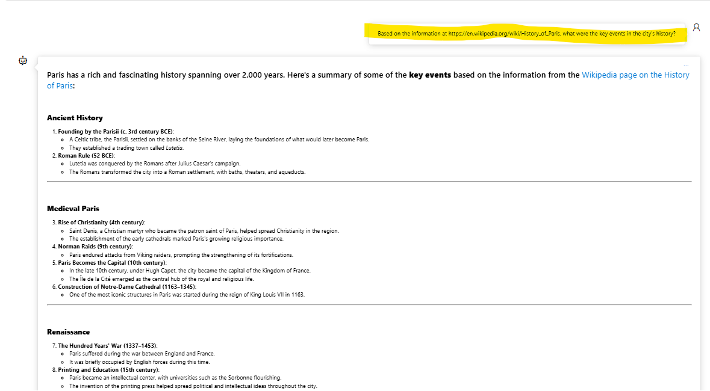
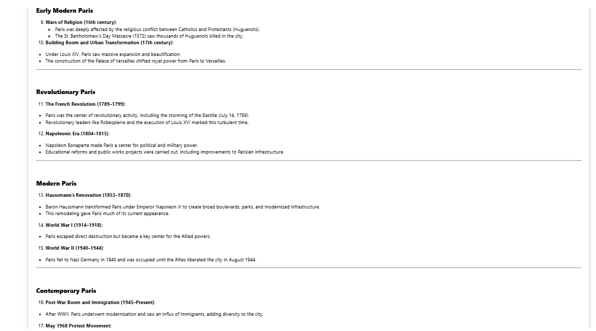

13 - Revise a resposta, que deve fornecer informações com base no site fornecido.

14 - Vamos tentar adicionar contexto para maximizar a relevância da resposta. Insira o seguinte prompt:
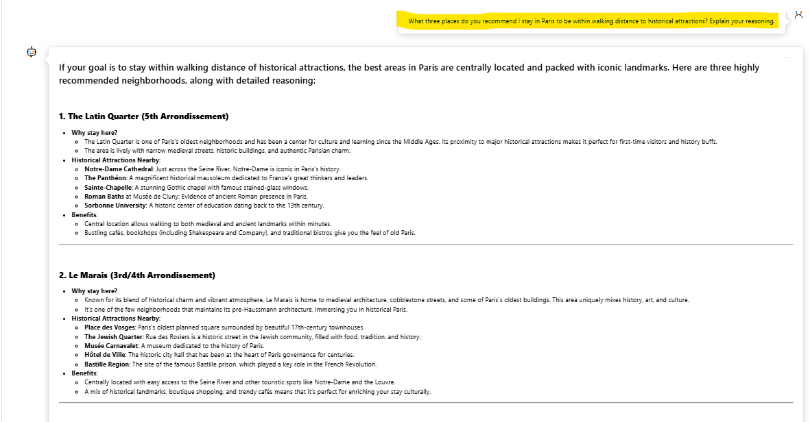
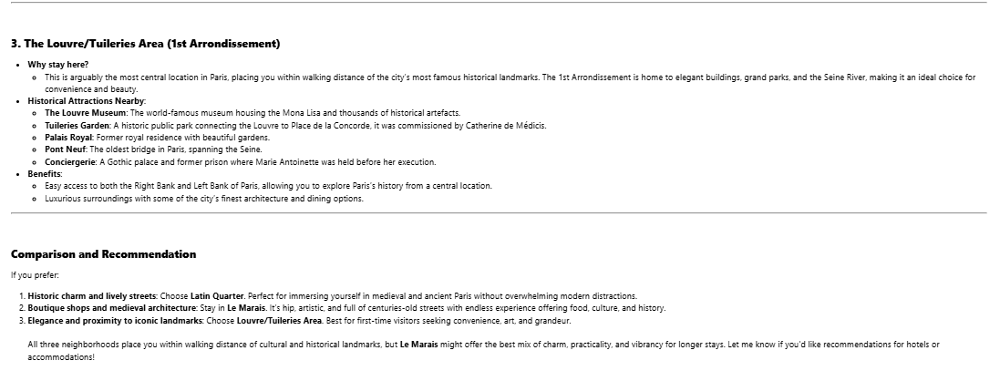

15 - Revise a resposta e o raciocínio para a resposta.

16 - Agora tente estabelecer expectativas claras para a resposta. Insira o seguinte prompt:
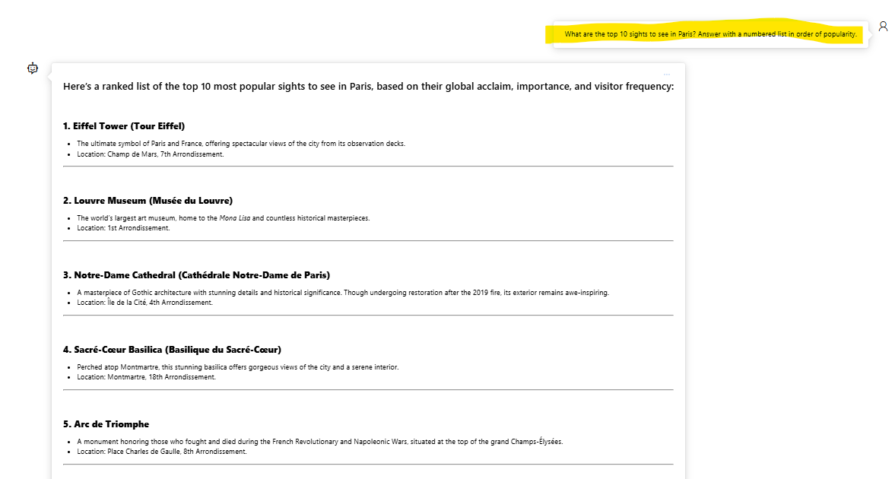
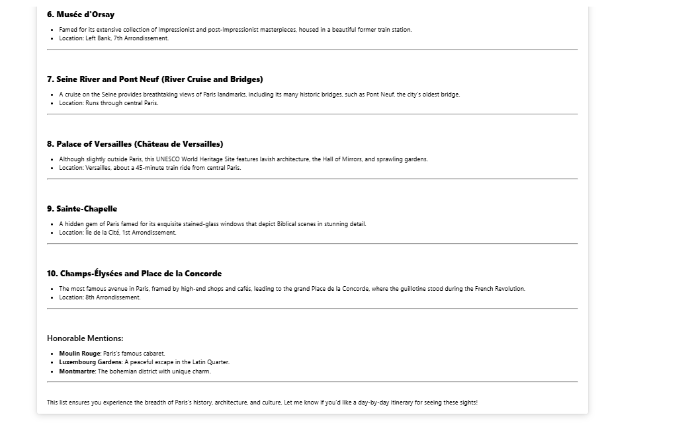

17 - Revise a resposta, que deve fornecer uma lista numerada de pontos turísticos para ver em Paris.

18 - Quando terminar, você pode fechar a janela do navegador.